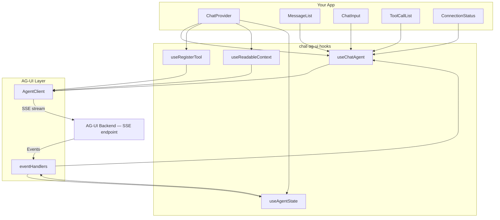
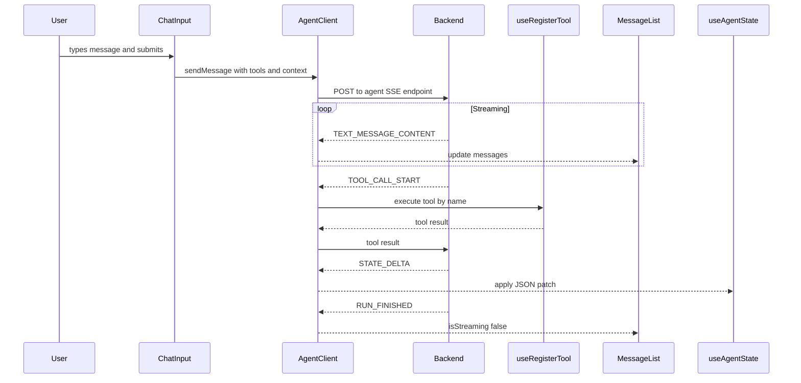
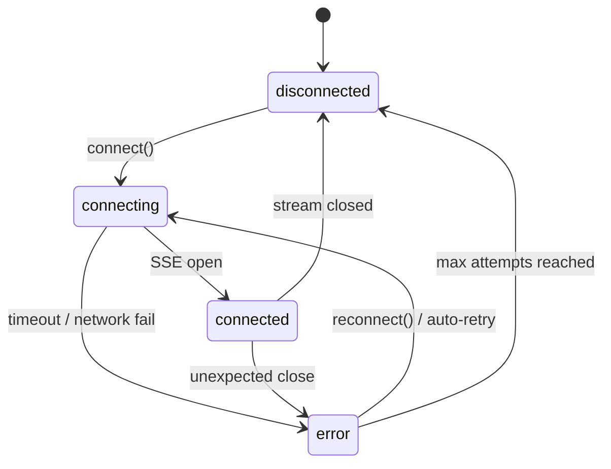
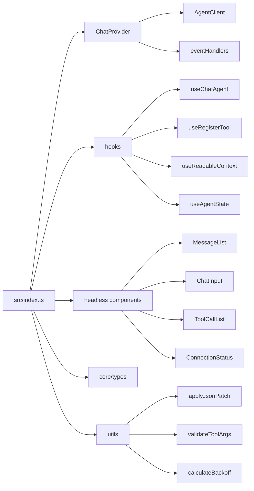

# chat-ag-ui

A headless React library for building chat interfaces over the [AG-UI protocol](https://docs.ag-ui.com). Zero UI opinions — bring your own styles and components.

## Overview

`chat-ag-ui` connects your React app to any AG-UI compatible backend via Server-Sent Events. It handles streaming, tool execution, context injection, and state synchronization, exposing everything through hooks and render-prop components.

```
npm install chat-ag-ui @ag-ui/client
# or
yarn add chat-ag-ui @ag-ui/client
```

**Peer dependencies:** `react ^18`, `@ag-ui/client >=0.0.1`

---

## Architecture



---

## Data Flow



---

## Connection State Machine



---

## Quick Start

```tsx
import { ChatProvider, MessageList, ChatInput, ConnectionStatus } from 'chat-ag-ui'

export default function App() {
  return (
    <ChatProvider endpoint="/api/agent">
      <Chat />
    </ChatProvider>
  )
}

function Chat() {
  return (
    <div>
      <ConnectionStatus>
        {({ status }) => <span>{status}</span>}
      </ConnectionStatus>

      <MessageList>
        {({ messages, isStreaming }) => (
          <>
            {messages.map(msg => (
              <div key={msg.id} className={`msg msg--${msg.role}`}>
                {msg.content}
              </div>
            ))}
            {isStreaming && <div>Agent is typing...</div>}
          </>
        )}
      </MessageList>

      <ChatInput submitOnEnter>
        {({ value, onChange, onSubmit, isDisabled }) => (
          <form onSubmit={onSubmit}>
            <input value={value} onChange={e => onChange(e.target.value)} />
            <button type="submit" disabled={isDisabled}>Send</button>
          </form>
        )}
      </ChatInput>
    </div>
  )
}
```

---

## API Reference

### `<ChatProvider>`

Root provider. Must wrap all other components and hooks.

| Prop | Type | Description |
|------|------|-------------|
| `endpoint` | `string` | AG-UI SSE endpoint URL |
| `headers` | `Record<string, string>` | Optional request headers |
| `reconnect` | `ReconnectConfig` | Auto-reconnect settings |
| `onConnect` | `() => void` | Called on successful connection |
| `onDisconnect` | `() => void` | Called on disconnect |
| `onError` | `(error: ChatError) => void` | Called on error |
| `onRunStart` | `(runId: string) => void` | Called when agent run starts |
| `onRunFinish` | `(runId: string) => void` | Called when agent run finishes |

```tsx
<ChatProvider
  endpoint="/api/agent"
  reconnect={{ enabled: true, maxAttempts: 5, delayMs: 1000, backoffMultiplier: 2 }}
  onError={err => console.error(err.code, err.message)}
>
```

---

### `useChatAgent()`

Core hook for connection control and message access.

```tsx
const { status, error, messages, isStreaming, connect, disconnect, sendMessage } = useChatAgent()
```

| Return | Type | Description |
|--------|------|-------------|
| `status` | `ConnectionStatus` | `'disconnected' \| 'connecting' \| 'connected' \| 'error'` |
| `error` | `Error \| null` | Last connection error |
| `messages` | `Message[]` | Full conversation history |
| `isStreaming` | `boolean` | `true` while agent is generating |
| `connect()` | `() => void` | Open SSE connection |
| `disconnect()` | `() => void` | Close connection |
| `sendMessage(text)` | `(text: string) => void` | Send a user message |

---

### `useRegisterTool(definition)`

Register a frontend-executable tool the agent can call.

```tsx
useRegisterTool({
  name: 'filterEvents',
  description: 'Filter events by faction name',
  parameters: {
    type: 'object',
    properties: {
      faction: { type: 'string', description: 'Faction name' },
    },
    required: ['faction'],
  },
  execute: async ({ faction }, { abortSignal }) => {
    // runs in the browser when the agent calls this tool
    return { results: events.filter(e => e.faction === faction) }
  },
})
```

---

### `useReadableContext(key, value, options?)`

Expose app state the agent can read. Context is sent with every message.

```tsx
useReadableContext('currentUser', { id: 42, name: 'Alice' }, {
  description: 'The currently logged-in user',
})
```

---

### `useAgentState<T>(selector?)`

Subscribe to `STATE_DELTA` JSON Patch updates dispatched by the agent.

```tsx
const mapState = useAgentState<{ selectedHex: string }>(s => s.selectedHex)
```

---

### Headless Components

All components use the render-prop pattern — they manage state and call your render function with the relevant data.

#### `<MessageList>`

```tsx
<MessageList className="messages">
  {({ messages, isStreaming }) => ( ... )}
</MessageList>
```

#### `<ChatInput>`

```tsx
<ChatInput submitOnEnter placeholder="Ask something...">
  {({ value, onChange, onKeyDown, onSubmit, isDisabled, placeholder }) => ( ... )}
</ChatInput>
```

#### `<ToolCallList>`

```tsx
<ToolCallList>
  {({ tools }) => tools.filter(t => t.status === 'running').map(t => (
    <div key={t.id}>Running: {t.name}</div>
  ))}
</ToolCallList>
```

#### `<ConnectionStatus>`

```tsx
<ConnectionStatus>
  {({ status, error, reconnect }) => ( ... )}
</ConnectionStatus>
```

---

## Package Structure



---

## Development

```bash
yarn install       # Install dependencies
yarn dev           # Run demo app (http://localhost:5174)
yarn build         # Build library to dist/
yarn typecheck     # TypeScript check
yarn lint          # ESLint
yarn test:unit     # Vitest unit tests
yarn test:ct       # Playwright component tests
yarn test:visual   # Visual regression tests
```

---

## AG-UI Protocol

This library implements the [AG-UI protocol](https://docs.ag-ui.com) — an open standard for streaming agentic UI interactions.

Key resources:

- [AG-UI Protocol Overview](https://docs.ag-ui.com/introduction/overview)
- [AG-UI Event Reference](https://docs.ag-ui.com/sdk/js/core/events)
- [`@ag-ui/client` SDK](https://docs.ag-ui.com/sdk/js/client/overview)
- [Tool Calling](https://docs.ag-ui.com/concepts/tools)
- [State Management / STATE_DELTA](https://docs.ag-ui.com/concepts/state)
- [GitHub: ag-ui-protocol/ag-ui](https://github.com/ag-ui-protocol/ag-ui)

---

## License

MIT
